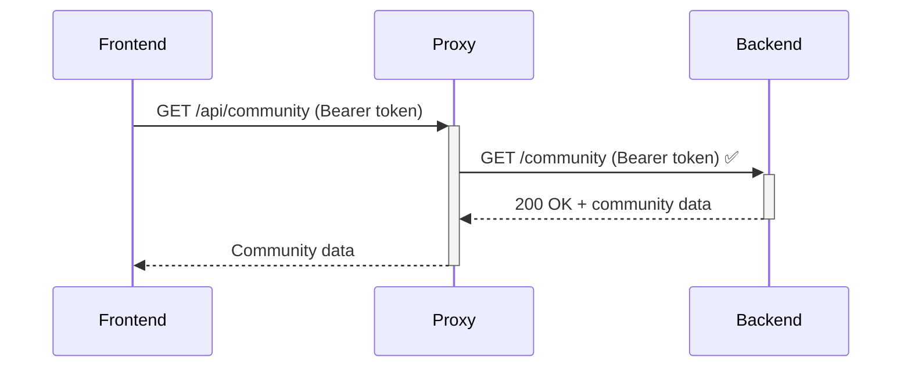

# Token Authentication Fixes

**Date:** September 13, 2025
**Issue:** Community data failing to load with 401 Unauthorized errors despite successful login

## Problem Summary

The application was experiencing persistent 401 authentication errors when trying to fetch community data, even though:
- Login was successful (200 OK)
- Backend API worked when called directly
- Tokens were being generated and stored correctly

## Root Cause Analysis

### Primary Issue: Missing Authorization Header in API Proxy

The Next.js API proxy route `/app/api/community/route.ts` was **not forwarding the Authorization header** to the backend in GET requests, while POST requests were correctly forwarding it.

**GET method (broken):**
```typescript
const response = await fetch(`${API_BASE_URL}/community/?page=${page}&limit=${limit}`, {
  method: 'GET',
  headers: {
    'Accept': 'application/json',  // Missing Authorization header!
  },
});
```

**POST method (working):**
```typescript
const authHeader = request.headers.get('authorization');
if (authHeader) {
  headers['Authorization'] = authHeader;  // Correctly forwards auth
}
```

### Secondary Issue: Token Refresh Race Condition

The automatic token refresh logic had a race condition where:
1. Original request uses expired token → 401 error
2. Token refresh succeeds and stores new token
3. Retry still used the old expired token (captured at function start)

## Fixes Applied

### 1. Fixed API Proxy Authorization Header Forwarding

**File:** `/app/api/community/route.ts`

Added missing authorization header forwarding to GET method:

```typescript
export async function GET(request: NextRequest) {
  const authHeader = request.headers.get('authorization');

  const headers: Record<string, string> = {
    'Accept': 'application/json',
  };

  if (authHeader) {
    headers['Authorization'] = authHeader;  // Now forwards auth header
  }

  const response = await fetch(url, { method: 'GET', headers });
}
```

### 2. Fixed Token Refresh Logic

**File:** `/app/lib/api.ts`

Enhanced automatic token refresh with better retry logic:

```typescript
async function makeRequest<T>(endpoint: string, options: RequestInit = {}, retryCount = 0) {
  // Get FRESH token from localStorage on each call (including retries)
  const token = localStorage.getItem('access_token')

  // On 401 errors, refresh token and retry with new token
  if (response.status === 401 && retryCount === 0) {
    // Refresh logic stores new tokens in localStorage
    localStorage.setItem('access_token', newToken)
    // Recursive call will get fresh token from localStorage
    return makeRequest<T>(endpoint, options, retryCount + 1)
  }
}
```

### 3. Created Missing Refresh API Endpoint

**File:** `/app/api/auth/refresh/route.ts`

Created the missing refresh endpoint that proxies to backend:

```typescript
export async function POST(request: NextRequest) {
  const response = await fetch(`${API_BASE_URL}/auth/refresh`, {
    method: 'POST',
    headers: { 'Content-Type': 'application/json' },
    body: JSON.stringify(await request.json()),
  });

  return NextResponse.json(await response.json());
}
```

### 4. Fixed Login Redirect URLs

**File:** `/app/lib/api.ts`

Updated incorrect redirect paths:
- Changed `/auth/login` → `/sign-in` (correct login page path)

## Technical Details

### Token Lifecycle
1. **Login:** `auth-context.tsx` → `authService.storeAuthData()` → Sets initial tokens
2. **API Call:** `api.ts makeRequest()` → Gets token from localStorage
3. **Token Expired:** Auto-refresh → Updates localStorage with new tokens
4. **Retry:** Gets fresh token from localStorage for retry attempt

### JWT Token Analysis
- Tokens were expiring in ~8 minutes (very short lifetime)
- Format: `{"exp": 1757773926, "sub": "user-id", "type": "access"}`
- Backend clock sync was correct (no timezone issues)

### Authentication Flow


## Testing Verification

**Before Fix:**
- Direct backend call: ✅ 200 OK
- Proxy call: ❌ 401 Unauthorized

**After Fix:**
- Direct backend call: ✅ 200 OK
- Proxy call: ✅ 200 OK

## Files Modified

1. `/app/api/community/route.ts` - Added auth header forwarding to GET method
2. `/app/lib/api.ts` - Enhanced token refresh logic and debugging
3. `/app/api/auth/refresh/route.ts` - Created missing refresh endpoint (new file)

## Debugging Tools Added

Added comprehensive logging to track token lifecycle:
- Token expiration times and validity periods
- Original vs retry request identification
- Auth header presence/absence in proxy requests
- Token refresh success/failure details

## Prevention

To prevent similar issues:
1. **Consistent Auth Handling:** Ensure all API proxy routes forward authorization headers
2. **Fresh Token Access:** Always get tokens from localStorage, never cache them
3. **Comprehensive Logging:** Log auth header presence in all proxy routes
4. **Token Lifecycle Testing:** Test both direct backend and proxy routes

## Future Endpoint Implementation Guidelines

### 1. Standard API Proxy Route Template

**Always use this template for new authenticated endpoints:**

```typescript
// /app/api/[endpoint]/route.ts
import { NextRequest, NextResponse } from 'next/server';

const API_BASE_URL = 'https://civic-data-trust-backend.onrender.com/api/v1';

export async function GET(request: NextRequest) {
  try {
    // Extract URL parameters if needed
    const { searchParams } = new URL(request.url);
    const param1 = searchParams.get('param1') || 'default';

    // ALWAYS get authorization header
    const authHeader = request.headers.get('authorization');

    console.log('=== [Endpoint] Proxy Request ===');
    console.log('Backend URL:', `${API_BASE_URL}/your-endpoint`);
    console.log('Auth header:', authHeader ? 'Present' : 'Missing');

    // ALWAYS prepare headers object
    const headers: Record<string, string> = {
      'Accept': 'application/json',
      'Content-Type': 'application/json',
    };

    // ALWAYS forward authorization header if present
    if (authHeader) {
      headers['Authorization'] = authHeader;
    }

    const response = await fetch(`${API_BASE_URL}/your-endpoint`, {
      method: 'GET',
      headers,
    });

    console.log('Backend response status:', response.status);

    const data = await response.json();

    if (!response.ok) {
      console.log('Backend error:', data);
      return NextResponse.json(
        { error: data.detail || data.message || 'Request failed' },
        { status: response.status }
      );
    }

    return NextResponse.json(data, { status: response.status });
  } catch (error) {
    console.error('Proxy error:', error);
    return NextResponse.json(
      { error: 'Proxy error occurred' },
      { status: 500 }
    );
  }
}

export async function POST(request: NextRequest) {
  try {
    const body = await request.json();
    const authHeader = request.headers.get('authorization');

    const headers: Record<string, string> = {
      'Content-Type': 'application/json',
      'Accept': 'application/json',
    };

    if (authHeader) {
      headers['Authorization'] = authHeader;
    }

    const response = await fetch(`${API_BASE_URL}/your-endpoint`, {
      method: 'POST',
      headers,
      body: JSON.stringify(body),
    });

    const data = await response.json();

    if (!response.ok) {
      return NextResponse.json(
        { error: data.detail || data.message || 'Request failed' },
        { status: response.status }
      );
    }

    return NextResponse.json(data, { status: response.status });
  } catch (error) {
    console.error('Proxy error:', error);
    return NextResponse.json({ error: 'Proxy error occurred' }, { status: 500 });
  }
}
```

### 2. Frontend API Service Pattern

**Always follow this pattern in `/app/lib/api.ts`:**

```typescript
export const api = {
  yourEndpoint: {
    // GET requests
    getAll: (param1?: string) =>
      makeRequest<YourType[]>(`/your-endpoint?param1=${param1 || ''}`),

    getById: (id: string) =>
      makeRequest<YourType>(`/your-endpoint/${id}`),

    // POST requests
    create: (data: CreateType) =>
      makeRequest<YourType>(`/your-endpoint`, {
        method: 'POST',
        body: JSON.stringify(data)
      }),

    // PUT requests
    update: (id: string, data: UpdateType) =>
      makeRequest<YourType>(`/your-endpoint/${id}`, {
        method: 'PUT',
        body: JSON.stringify(data)
      }),

    // DELETE requests
    delete: (id: string) =>
      makeRequest<{ success: boolean }>(`/your-endpoint/${id}`, {
        method: 'DELETE'
      })
  }
}
```

### 3. Required Auth Checklist

**Before implementing any new authenticated endpoint:**

- [ ] ✅ Extract `authHeader` from request
- [ ] ✅ Create headers object with Accept/Content-Type
- [ ] ✅ Forward authHeader if present: `headers['Authorization'] = authHeader`
- [ ] ✅ Add logging: `console.log('Auth header:', authHeader ? 'Present' : 'Missing')`
- [ ] ✅ Test with direct backend call first
- [ ] ✅ Test with proxy route second
- [ ] ✅ Verify both return same results
- [ ] ✅ Test with expired token (should trigger refresh)
- [ ] ✅ Test with no token (should return 401)

### 4. Common Mistakes to Avoid

#### ❌ **DON'T DO THIS:**
```typescript
// Missing auth header forwarding
const response = await fetch(url, {
  headers: {
    'Accept': 'application/json' // Missing Authorization!
  }
});

// Hardcoded token
headers['Authorization'] = 'Bearer hardcoded-token';

// Cached token at function level
const token = localStorage.getItem('access_token'); // Don't cache!
function makeMultipleCalls() {
  // Uses stale token
}
```

#### ✅ **DO THIS:**
```typescript
// Always forward auth header
const authHeader = request.headers.get('authorization');
if (authHeader) {
  headers['Authorization'] = authHeader;
}

// Always get fresh token
function makeRequest() {
  const token = localStorage.getItem('access_token'); // Fresh on each call
}
```

### 5. Testing Checklist for New Endpoints

**Manual Testing Steps:**

1. **Direct Backend Test:**
   ```bash
   curl -H "Authorization: Bearer YOUR_TOKEN" \
        -H "Content-Type: application/json" \
        https://civic-data-trust-backend.onrender.com/api/v1/your-endpoint
   ```

2. **Proxy Test:**
   ```javascript
   // In browser console
   fetch('/api/your-endpoint', {
     headers: {
       'Authorization': `Bearer ${localStorage.getItem('access_token')}`,
       'Content-Type': 'application/json'
     }
   })
   ```

3. **Authentication Scenarios:**
   - ✅ Valid token → Should work
   - ✅ Expired token → Should auto-refresh and retry
   - ✅ No token → Should return 401
   - ✅ Invalid token → Should return 401

### 6. Environment Configuration

**Always use environment-aware URLs:**

```typescript
// ✅ Good - respects proxy settings
const API_BASE_URL = process.env.NEXT_PUBLIC_USE_PROXY !== 'false'
  ? '/api'
  : 'https://civic-data-trust-backend.onrender.com/api/v1';

// ❌ Bad - hardcoded
const API_BASE_URL = 'https://civic-data-trust-backend.onrender.com/api/v1';
```

### 7. Error Handling Standards

**Always include proper error handling:**

```typescript
if (!response.ok) {
  console.log('Backend error response:', data);
  return NextResponse.json(
    {
      error: data.detail || data.message || 'Operation failed',
      status: response.status,
      endpoint: '/your-endpoint' // Help with debugging
    },
    { status: response.status }
  );
}
```

### 8. Quick Reference Commands

**Check existing proxy routes for auth issues:**
```bash
grep -r "fetch.*API_BASE_URL" app/api/ | grep -v "authorization\|Authorization"
```

**Find endpoints missing auth header forwarding:**
```bash
find app/api -name "*.ts" -exec grep -L "authorization" {} \;
```

## Related Issues

- Short token lifetimes (8 minutes) may need backend configuration review
- Consider implementing token refresh before expiration (proactive vs reactive)
- Review other API proxy routes for similar missing auth header issues
- Consider implementing middleware for consistent auth header forwarding